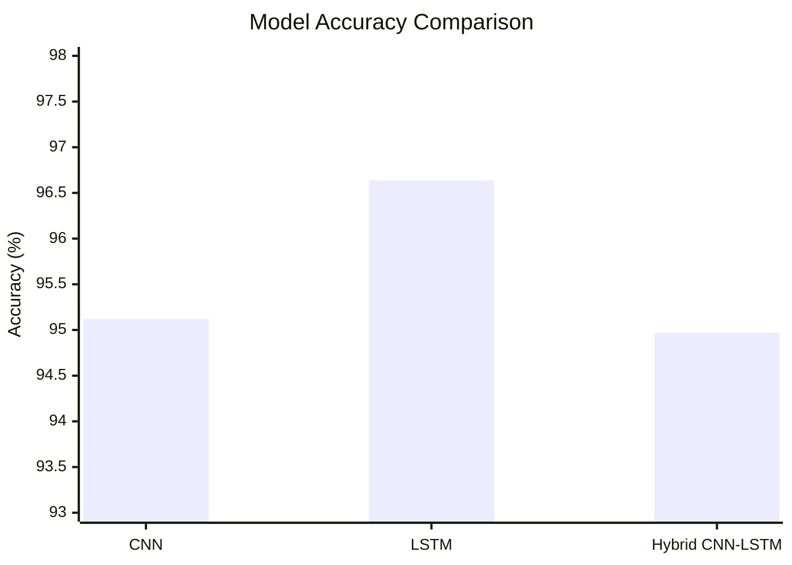
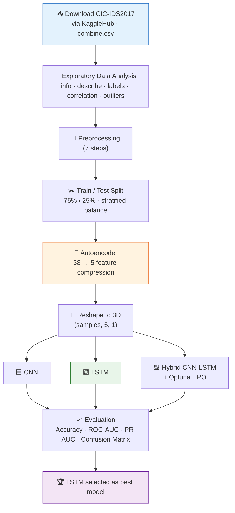
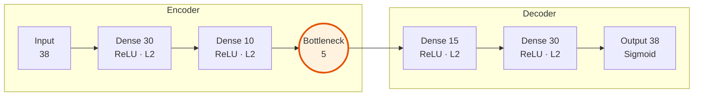
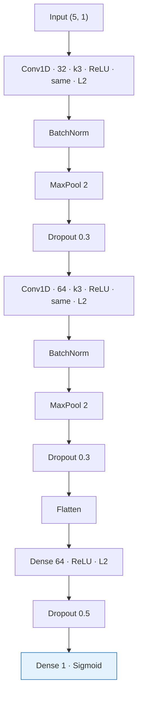
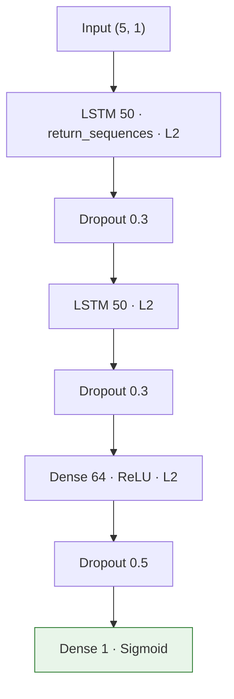
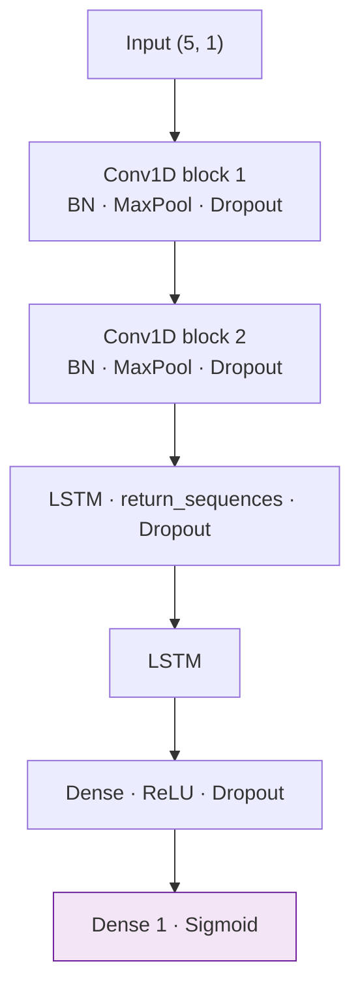

# 🛡️ Network Intrusion Detection on CIC-IDS2017 — CNN vs. LSTM vs. Hybrid CNN-LSTM

> A deep-learning study that benchmarks three neural architectures — **CNN**, **LSTM**, and a **Hybrid CNN-LSTM** — for detecting cyber attacks in network flow traffic, using an **autoencoder** for feature compression and **Optuna** for hyperparameter search on the 2.2-million-row **CIC-IDS2017** dataset.

<p align="center">
  
  
  
  
  
  
</p>

---

## 📑 Table of Contents

- [Overview](#-overview)
- [Key Results](#-key-results-at-a-glance)
- [The Dataset](#-the-dataset)
- [End-to-End Pipeline](#-end-to-end-pipeline)
- [Preprocessing, Step by Step](#-preprocessing-step-by-step)
- [Autoencoder for Dimensionality Reduction](#-autoencoder-for-dimensionality-reduction)
- [Model Architectures](#-model-architectures)
- [Hyperparameter Optimization (Optuna)](#-hyperparameter-optimization-optuna)
- [Evaluation & Results](#-evaluation--results)
- [How to Run](#-how-to-run)
- [Requirements](#-requirements)
- [Project Structure](#-project-structure)
- [Design Notes & Limitations](#-design-notes--limitations)

---

## 🔍 Overview

Modern networks generate enormous volumes of traffic, and hidden inside that traffic are attacks — denial-of-service floods, port scans, botnet callbacks, and more. This project frames intrusion detection as a **binary classification** problem: given the statistical fingerprint of a single network flow, decide whether it is **`BENIGN` (0)** or an **`ATTACK` (1)**.

The notebook ([`ids.ipynb`](ids.ipynb)) walks through the complete machine-learning lifecycle:

1. **Acquire** the CIC-IDS2017 dataset from Kaggle (≈ 2.2 M flows, 79 features).
2. **Explore** it — class balance, correlations, outliers, missing values.
3. **Clean & engineer** — remove constant/collinear features, clip outliers, impute, scale, and rebalance the classes.
4. **Compress** the feature space with an **autoencoder** (38 → 5 dimensions).
5. **Train & compare** three deep architectures on the compressed representation.
6. **Tune** the hybrid model with **Optuna**.
7. **Evaluate** everyone on Accuracy, ROC-AUC, PR-AUC, and confusion matrices.

**Headline finding:** the **standalone LSTM wins** across every metric. The CNN is a close, cheaper-to-train runner-up, and the more complex Hybrid CNN-LSTM does **not** beat the simpler standalone models on this task.

---

## 🏆 Key Results at a Glance

| Model | Accuracy | ROC-AUC | PR-AUC | Trainable Params | Verdict |
|:------|:--------:|:-------:|:------:|:----------------:|:--------|
| **LSTM** 🥇 | **0.9664** | **0.9948** | **0.9948** | ~33.9 K | Best overall — most reliable discrimination |
| **CNN** 🥈 | 0.9512 | 0.9904 | 0.9905 | ~10.7 K | Strong & fastest — great efficiency trade-off |
| **Hybrid CNN-LSTM** 🥉 | 0.9497 | 0.9899 | 0.9899 | Optuna-tuned | Most complex, yet no accuracy gain |



> **Takeaway:** more architectural complexity ≠ better performance. After autoencoder compression, the sequential inductive bias of the LSTM extracts the most signal from just 5 encoded features.

---

## 📊 The Dataset

The project uses **[CIC-IDS2017](https://www.unb.ca/cic/datasets/ids-2017.html)** (Canadian Institute for Cybersecurity), pulled via **KaggleHub** from `sweety18/cicids2017-full-dataset` (the combined `combine.csv`).

| Property | Value |
|:---------|:------|
| Rows (flows) | **2,214,469** |
| Columns | **79** (77 numeric + `Destination Port` + `Label`) |
| Raw size | ~1.3 GB |
| Target | `Label` (10 traffic classes) |

### Class distribution (highly imbalanced)

| Label | Count | Share |
|:------|------:|------:|
| BENIGN | 1,672,837 | 75.5% |
| DoS Hulk | 231,073 | 10.4% |
| PortScan | 158,930 | 7.2% |
| DDoS | 128,027 | 5.8% |
| DoS GoldenEye | 10,293 | 0.46% |
| DoS slowloris | 5,796 | 0.26% |
| DoS Slowhttptest | 5,499 | 0.25% |
| Bot | 1,966 | 0.09% |
| Infiltration | 36 | 0.002% |
| Heartbleed | 11 | 0.0005% |

These ten classes are collapsed into a **binary target** (`BENIGN` → 0, everything else → 1), giving **1,672,837 benign** vs **541,632 attack** flows before rebalancing.

---

## 🔗 End-to-End Pipeline



---

## 🧹 Preprocessing, Step by Step

The raw 79-column table is aggressively pruned into a lean, model-ready matrix. Each step is a real cell in the notebook.

```mermaid
flowchart LR
    S0["79 cols"] --> S1["Drop 'Destination Port'<br/>→ 78 cols"]
    S1 --> S2["Remove zero-variance<br/>77 → 69 numeric"]
    S2 --> S3["IQR outlier clipping<br/>1.5×IQR bounds"]
    S3 --> S4["Drop |corr| > 0.9<br/>−30 features → 39 cols"]
    S4 --> S5["inf → NaN → median fill"]
    S5 --> S6["Label encode<br/>BENIGN=0 / attack=1"]
    S6 --> S7["StandardScaler<br/>μ=0, σ=1"]
    S7 --> S8["RandomUnderSampler<br/>balanced 541,632 / class"]
    style S0 fill:#ffebee,stroke:#c62828
    style S8 fill:#e8f5e9,stroke:#2e7d32
```



| # | Step | What happens | Effect |
|:-:|:-----|:-------------|:-------|
| 0 | **Clean column names** | `str.strip()` on headers | Removes stray spaces |
| 1 | **Drop identifier** | Remove `Destination Port` | 79 → 78 cols |
| 2 | **Zero-variance filter** | Drop constant numeric columns | 77 → 69 numeric features |
| 3 | **Outlier handling** | Clip each feature to `[Q1 − 1.5·IQR, Q3 + 1.5·IQR]` | Tames extreme flow values |
| 4 | **Decorrelation** | Drop features with pairwise `|corr| > 0.9` (30 removed) | 39 cols (38 numeric + Label) |
| 5 | **Missing / infinite** | `±inf → NaN`, then median imputation | No gaps remain |
| 6 | **Label encoding** | `BENIGN → 0`, all attacks → `1` | Binary target |
| 7 | **Standardization** | `StandardScaler` (fit on features) | Zero-mean, unit-variance |
| 8 | **Class balancing** | `RandomUnderSampler` | 541,632 per class → **1,083,264** rows |

**Train/test split:** 75% / 25% → **812,448** training and **270,816** testing rows, near-perfectly balanced in both splits.

---

## 🧠 Autoencoder for Dimensionality Reduction

Rather than feed 38 features straight into the classifiers, the notebook first trains an **undercomplete autoencoder** to squeeze the input down to a **5-dimensional bottleneck**, keeping only the most reconstructive signal. The encoder half is then reused as a fixed feature extractor.



- **Optimizer:** Adam (`lr = 1e-5`) · **Loss:** Mean Squared Error · **Epochs:** 30 · **Batch:** 128
- **L2 regularization** on all dense layers for stability.
- Final **test reconstruction loss ≈ 0.408**, with train/val curves converging (no overfitting).
- The trained encoder (`dense_2` output) maps every flow to **5 encoded features**, which are reshaped to **`(samples, 5, 1)`** so the 1D-conv / recurrent layers can consume them.
- Feature-importance-by-variance analysis showed encoded features **#3, #1, #5** carry most of the signal, while feature **#2 collapsed to zero variance** — a hint the 5-dim bottleneck could likely shrink further.

> 💡 The autoencoder is saved as `autoencoder_model.h5` for reuse.

---

## 🏗️ Model Architectures

All three classifiers consume the same input tensor: `(5, 1)` — the 5 encoded features as a length-5 sequence with one channel. Every model shares the same **regularization toolkit**: Dropout, L2 weight decay, Batch Normalization (CNN/hybrid), plus three callbacks — **EarlyStopping** (patience 3, restore best weights), **ReduceLROnPlateau** (×0.5, patience 2), and **ModelCheckpoint** (save best on val-loss).

### 🟦 CNN (~10.7 K trainable params)



Two convolutional blocks learn local patterns across the encoded feature sequence, then a dense head makes the call. Lightest and fastest of the three.

### 🟩 LSTM (~33.9 K trainable params) — 🏆 best



Two stacked LSTM layers treat the 5 encoded features as a sequence, capturing dependencies between them. This inductive bias turns out to fit the compressed representation best.

### 🟪 Hybrid CNN-LSTM (Optuna-tuned)



Convolutional blocks extract local features first, then LSTM layers model their sequence — the theory being "best of both worlds." In practice, it landed **last**.

---

## 🎛️ Hyperparameter Optimization (Optuna)

The hybrid model's architecture is searched with **Optuna** (`direction="maximize"`, 20 trials), maximizing validation accuracy over:

| Hyperparameter | Search space |
|:---------------|:-------------|
| `cnn_filters1` | {32, 64} |
| `cnn_filters2` | {64, 128} |
| `kernel_size` | 2 – 5 |
| `dropout_cnn` | 0.2 – 0.5 |
| `lstm_units` | 50 – 100 |
| `dropout_lstm` | 0.2 – 0.5 |
| `dense_units` | 32 – 128 |
| `dropout_dense` | 0.3 – 0.6 |
| `l2_factor` | 1e-5 – 1e-2 (log) |
| `learning_rate` | 1e-5 – 1e-3 (log) |

The best trial's parameters are then used to build and train the final hybrid model.

---

## 📈 Evaluation & Results

Each model is scored with a shared `evaluate_model()` helper that reports **Accuracy**, **ROC-AUC**, **PR-AUC**, a full **classification report**, and a **confusion matrix**, followed by overlaid **ROC** and **Precision-Recall** curves for all three.

### Final comparison

| Model | Accuracy | ROC-AUC | PR-AUC | Precision (attack) | Recall (attack) | F1 |
|:------|:--------:|:-------:|:------:|:------------------:|:---------------:|:--:|
| **LSTM** 🥇 | **0.9664** | **0.9948** | **0.9948** | 0.96 | 0.97 | 0.97 |
| CNN 🥈 | 0.9512 | 0.9904 | 0.9905 | 0.95 | 0.96 | 0.95 |
| Hybrid 🥉 | 0.9497 | 0.9899 | 0.9899 | 0.94 | 0.96 | 0.95 |

Evaluated on the held-out **270,816-flow** test set (≈135 K per class).

### Reading the numbers

- **LSTM** delivers the cleanest separation — near-perfect ROC/PR-AUC (0.9948) and the top accuracy — making it the most dependable detector here.
- **CNN** trails by ~1.5 points of accuracy but trains fastest and is a strong pick when latency or compute is the constraint.
- **Hybrid CNN-LSTM**, despite tuning, doesn't out-perform either standalone model — evidence that stacking CNN + LSTM adds cost without added signal on this compressed 5-feature input.

### Recommendation

1. **Ship the LSTM** when accuracy is the priority and you can afford the (still modest) compute.
2. **Use the CNN** when you want ~95% accuracy at the lowest training/inference cost.

---

## ▶️ How to Run

This is a self-contained Jupyter notebook, easiest to run in **Google Colab** (GPU recommended — the LSTM trains for 30 epochs over 800 K+ rows).

```bash
# 1. Clone
git clone https://github.com/Saad07Khan/Intrusion-Detection-System.git
cd Intrusion-Detection-System

# 2. (Optional) create an environment
python -m venv .venv && source .venv/bin/activate

# 3. Install dependencies
pip install pandas numpy seaborn matplotlib scikit-learn imbalanced-learn \
            tensorflow keras kagglehub optuna scipy

# 4. Launch
jupyter notebook ids.ipynb
```

Then **run the cells top to bottom**. The dataset downloads automatically via KaggleHub on first run — you'll need Kaggle credentials configured. In Colab, just execute the cells; paths default to `/content/Dataset`.

> ⚠️ **Heads-up:** the full run is heavy — the balanced training set is ~812 K rows and each deep model trains for up to 30 epochs. A GPU runtime is strongly recommended.

---

## 📦 Requirements

| Category | Packages |
|:---------|:---------|
| Core / data | `python 3.x`, `pandas`, `numpy`, `scipy` |
| Visualization | `matplotlib`, `seaborn` |
| ML / preprocessing | `scikit-learn`, `imbalanced-learn` |
| Deep learning | `tensorflow`, `keras` |
| Data & tuning | `kagglehub`, `optuna` |

---

## 🗂️ Project Structure

```
Intrusion-Detection-System/
├── ids.ipynb      # End-to-end notebook: EDA → preprocessing → autoencoder → CNN/LSTM/Hybrid → evaluation
└── README.md      # You are here
```

**Artifacts produced at runtime** (not committed): `autoencoder_model.h5`, `best_cnn_model.h5`, `best_lstm_model.h5`, `best_hybrid_model.h5`.

---

## 🧭 Design Notes & Limitations

- **Binary, not multi-class.** The 10 CIC-IDS2017 attack types are folded into a single "attack" label. This simplifies the problem but discards the ability to *name* the attack. Extending to multi-class classification is a natural next step.
- **Undersampling discards data.** `RandomUnderSampler` throws away ~1.13 M benign flows to balance the classes. It's simple and effective here, but oversampling (e.g. SMOTE) or class weights would retain more information.
- **Rare classes are essentially invisible.** `Infiltration` (36) and `Heartbleed` (11) are so rare that, even in the binary framing, they contribute almost nothing to the attack class.
- **Aggressive bottleneck.** Compressing 38 features to 5 is drastic — and one encoded dimension collapsed to zero variance, suggesting the model effectively uses ~4. Worth ablating the bottleneck size.
- **Legacy `.h5` format.** Models are saved as HDF5; Keras now recommends the native `.keras` format.
- **Reproducibility.** Seeds are set (`np.random.seed(42)`, `random_state=42`), but full determinism on GPU/TensorFlow also requires TF-level seeding.

---

<p align="center"><sub>Built with TensorFlow · scikit-learn · Optuna on the CIC-IDS2017 dataset.</sub></p>
